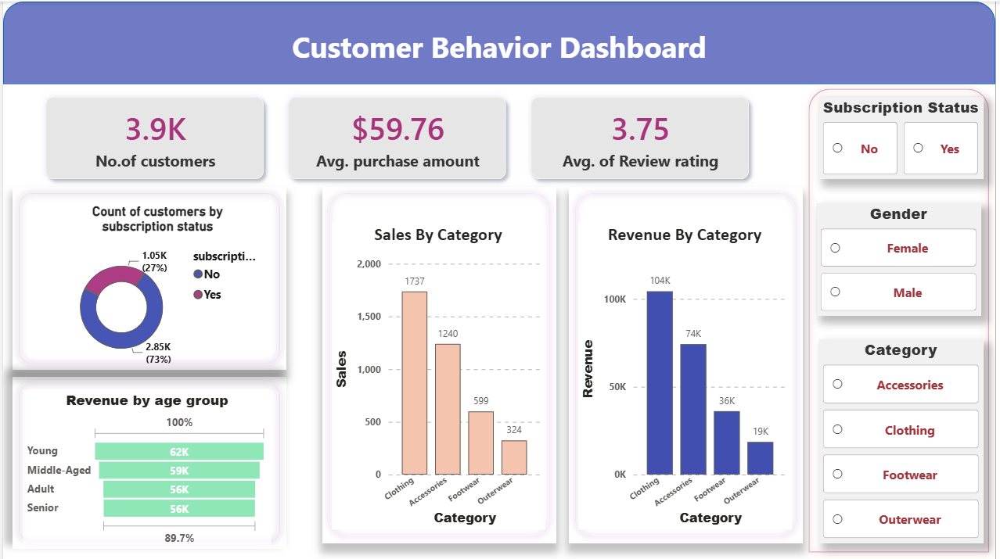

# 📊 Customer Behavior Analysis using PostgreSQL & Power BI


End-to-end data analytics project that uses **PostgreSQL** for business analysis and **Power BI** for interactive dashboard development to uncover customer purchasing behavior, identify business trends, and generate actionable insights for decision-making.

## 📌 Project Summary

| Attribute | Details |
|------------|---------|
| Domain | Retail Analytics |
| Dataset | Customer Purchase Behavior |
| Records | ~3,900 Customers |
| Database | PostgreSQL |
| Visualization | Power BI |
| SQL Concepts | CTEs, Window Functions, CASE, GROUP BY |
| Dashboard | Interactive |

## 📈 Dashboard Preview
The interactive dashboard provides key business KPIs, customer segmentation insights, and dynamic filtering capabilities to support data-driven decision-making.

---

## 📖 Project Overview

Organizations collect large volumes of customer transaction data but often struggle to transform it into meaningful insights. This project demonstrates how SQL-based analysis and interactive dashboards can be combined to support data-driven business decisions.

The workflow includes:

- Data cleaning
- Exploratory data analysis using PostgreSQL
- Business-oriented SQL queries
- Interactive Power BI dashboard development
- Insight generation and business recommendations

---

## 🎯 Business Objectives

This project aims to answer the following business questions:

- Which product category generates the highest revenue?
- How does subscription status affect customer spending?
- Which age group contributes the most revenue?
- Which gender contributes more to sales?
- How do customer ratings vary across categories?
- Which customer segments generate the highest business value?

---

## 🛠️ Technologies Used

| Tool | Purpose |
|------|---------|
| PostgreSQL | Data querying & business analysis |
| SQL | Data extraction and insights |
| Power BI | Interactive dashboard |
| Power Query | Data transformation |
| DAX | KPI calculations |
| Microsoft Excel | Dataset preparation |

---

## 📂 Dataset

The dataset contains customer purchase records with information including:

- Customer ID
- Age
- Gender
- Product Category
- Purchase Amount
- Review Rating
- Subscription Status
- Previous Purchases
- Payment Method
- Shipping Type
- Purchase Frequency

---

## 🔄 Project Workflow

```text
Raw Dataset
      │
      ▼
Data Cleaning
      │
      ▼
PostgreSQL Analysis
      │
      ▼
Business Insights
      │
      ▼
Power BI Dashboard
      │
      ▼
Business Recommendations
```

---

## 📊 Dashboard Features

### KPIs

- Total Customers
- Average Purchase Amount
- Average Review Rating

### Visualizations

- Revenue by Category
- Sales by Category
- Revenue by Age Group
- Subscription Distribution

### Interactive Filters

- Gender
- Subscription Status
- Product Category

---

## 🗄️ SQL Analysis

The SQL analysis focuses on answering real business questions.

### Analysis Performed

- Revenue Analysis
- Customer Segmentation
- Revenue by Age Group
- Revenue by Gender
- Subscription Analysis
- Product Category Analysis
- Seasonal Sales Analysis
- Discount Analysis
- Customer Review Analysis

### SQL Concepts Used

- Aggregate Functions
- GROUP BY
- HAVING
- CASE WHEN
- Common Table Expressions (CTEs)
- Window Functions
- Ranking Functions
- Subqueries

SQL scripts are available inside the **SQL** folder.

---

## 💡 Key Business Insights

- Clothing generated the highest revenue among all product categories.
- Subscribers accounted for a large proportion of total customer purchases.
- Young and middle-aged customers generated the highest revenue.
- Revenue varied significantly across product categories.
- Customer review ratings remained relatively stable across different groups.

---

## 📢 Business Recommendations

- Increase investment in high-performing product categories.
- Develop targeted campaigns for non-subscribed customers.
- Personalize marketing strategies based on customer demographics.
- Strengthen customer retention programs for repeat buyers.
- Monitor customer reviews to improve product quality and customer satisfaction.

---

## 📁 Repository Structure

```
customer-behavior-analysis
│
├── Dashboard
│   └── customer_behavior_dashboard.pbix
│
├── Data
│   └── customer_behavior_cleaned.csv
│
├── Images
│   └── customer_behavior_dashboard.png
│
├── SQL
│   ├── analysis_queries.sql
│   └── insights.sql
│
├── README.md
└── LICENSE
```
---

## 🚀 Skills Demonstrated

- SQL
- PostgreSQL
- Power BI
- DAX
- Power Query
- Data Cleaning
- Data Visualization
- Dashboard Design
- Business Intelligence
- Exploratory Data Analysis
- Analytical Thinking

---

## 👨‍💻 Author

**Rishikesh Sahu**

B.Tech Biotechnology  
National Institute of Technology Rourkela

📧 Email: sahurishikesh808@gmail.com

🔗 GitHub: https://github.com/Rishi-d-Cash

💼 LinkedIn: https://www.linkedin.com/in/rishikesh-sahu-a24b14375?utm_source=share_via&utm_content=profile&utm_medium=member_android
